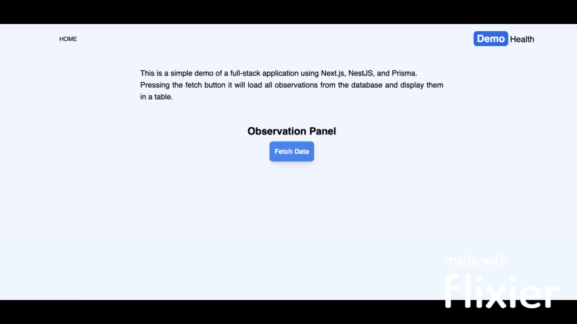
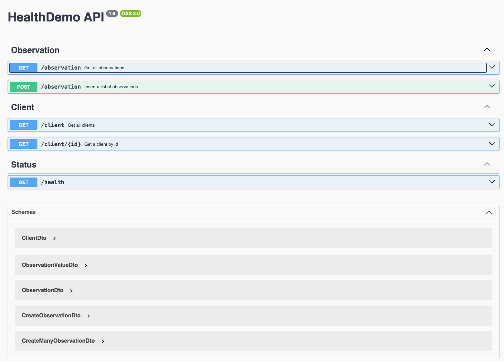

# DemoHealthProject

This is a demo project.
It creates a full-stack applicatation, Backend with NestJS, Prisma, and PostgreSQL, and Frontend with NextJs. Everything is containerized with Docker.

Try it out at this [address](https://webapp-bg4n3rtdzq-uc.a.run.app/) Hosted on Google Cloud Run.



## Infrastructure

The project is composed by 3 main parts as visible in the following diagram:


### Backend

The backend consist of a main API entrypoint and a data consumer microservice.

#### Main API

It is a NestJs application that uses Prisma as ORM and PostgreSQL as database.
It offers a simple REST API to manage `clients` and their `observations`.

The API can be used by the frontend to Fetch a list of Observation data and by the microservice to insert new data.
*(the idea is that the microservice is stateless and can be easily scaled, while the main API is stateful and can be used to manage the data)*

[More info](./main-app/README.md)

The API are documented with Swagger and can be accessed at `http://localhost:3002/api`.

Visit the api [here](https://main-app-bg4n3rtdzq-ey.a.run.app/api)



#### Data consumer

This is a separate stateless microservice that is meant to process new incoming data and send it to the main API.

In a real world scenarion, this service can be deployed as lambda function for example to consume incoming data from a queue.

In this project the data are fetched only once at startup and then sent to the main API.

[More info](./data-fetcher/README.md)

This service can be easily extended to consume data from different sources and different shape.

In this case, the data are fetched from a mock API and validated throw a [Zod schema](./data-fetcher/src/observations.dto.ts).

**Note**: Mock api seems to have a bug on the `date_birthdate` as they always return `1950-01-01`.

### Frontend

It is a web application created using NextJs.
It offers a simple UI to fetch a list of all observations.

Data are fetched from the backend API when the Button is pressed.

To avoid CORS issues and increase security, the data are fetched on the Server Side and passed to the frontend.

[More info](./webapp/README.md)

## How to run

To test locally the application, you need to have Docker installed.

Then you can run the following commands:

```bash
# Start the application
docker-compose up

# Stop the application
docker-compose down
```

The webapp is visible at `http://localhost:3000`.

## Future improvements

- Add unit tests across all projects
- Share common zod schema and types across projects
- Add pagination and filtering to API and Webapp
- Add authentication to API (must have for production)
- Add CI/CD pipeline
- Refactor communication between main-app and data fetcher to use gRPC instead of HTTP. This will allow to have a more efficient and secure communication between the two services.

## Data model

Ethnicity and Gender are stored as Enum in the database and are validated in the API.
The real enum values though needs refinement to ensure represent reality.

I've decided to split client and observation in 2 separate table to allow for better scalability and to avoid duplication of data.

The data fetcher assumes that each call get observation for a single client. This can be easily extended to fetch data for multiple clients at once.

The database is connected to the main-app to ensure data consistency and to allow for easy data management. The microservice should be as simple as possible and there should be a single source of truth for the data shape.
